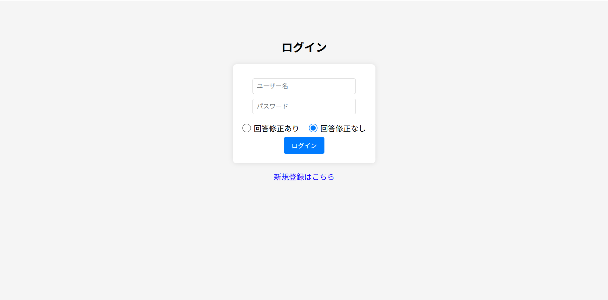
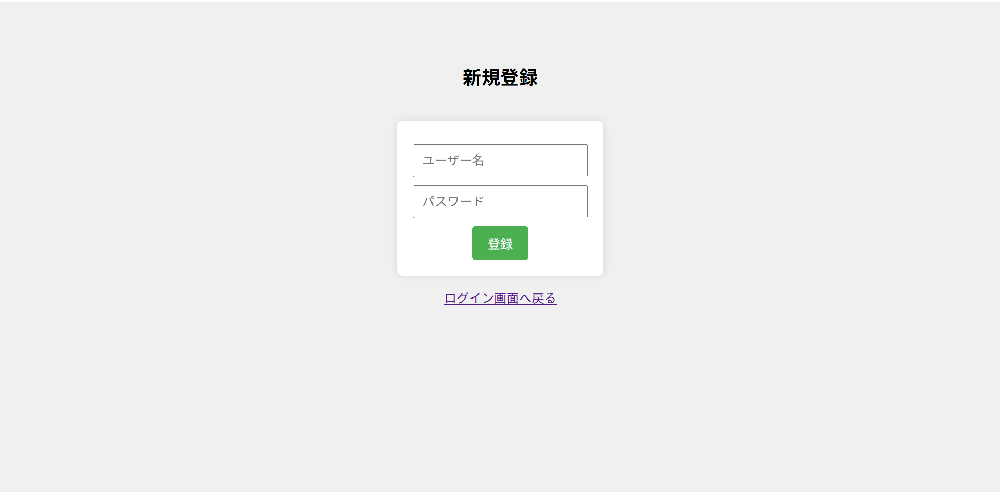
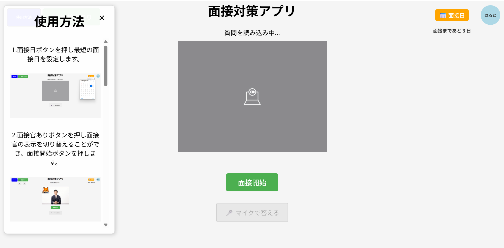

# AI面接対策アプリ

# 開発理由
 就職活動中、面接練習をしたいけれど、こんな悩み有りませんか？
- 学生時代に就職活動で面接対策をしたいが一人で学校のキャリアセンターに行くのが不安
- 面接対策をしてもらいたいが就活アドバイザーやキャリアセンターが営業時間外だったり、予約が取れなかったりして、練習する機会がない
- 自分のペースで、自宅で気軽に面接対策をしたい
> **このアプリは、そんな学生たちの声に応えるために開発しました。いつでも、どこでも、あなたに寄り添った面接対策をサポートします。**
---

# 本プロジェクトのディレクトリツリー

```
.AImensetutaisaku
├── README.md
├── css
│   ├── loginPage.css   (ログインページ用CSS）
|   ├── regiterPagePage.css   (新規登録ページ用CSS)
|   ├── style.css   (修正なしの面接ページ用CSS）
│   └── syusei.css      (修正ありの面接ページ用CSS）
├── javascript
│   ├── loginPage.js       (ログインページ用Javascript）
│   ├── registerPage.js       (新規登録ページ用Javascript）
│   ├── script.js       （修正なしの面接ページ用Javascript）
│   └── syusei.js          (修正ありの面接ページ用Javascript）
├── pictures （使用方法画像）
│   ├── 1.jpg
│   ├── 2.jpg
│   ├── 3.png
│   ├── 4.png
│   ├── 5.png
│   ├── loading.gif
│   ├── mensetubi.png
│   ├── mensetukan.png
│   ├── mensetukan2.png
│   ├── s1.png
│   ├── s2.png
│   ├── s3.png
│   ├── s4.png
│   └── s5.png
├── .env.example   (.envの作成参考ファイル）
├── .env   (Gemini APIキー設定）※各自作成
├── aiFeedback.js （フィードバック生成）
├── AImensetushu.xlsx （質問集の管理）
├── index.html （修正なしの面接ページ用html）
├── syusei.html （修正ありの面接ページ用html）
├── loginPage.html （ログインページ用html）
├── registerPage.html （新規登録ページ用html）
├── server.js （バックエンドサーバー）
├── package-lock.json （プロジェクトの依存関係）※各自作成
├── package.json （プロジェクトのメタデータ）※各自作成
└── users.txt    （ユーザー・パスワード管理用）

```

---

## インストールとセットアップ

プロジェクトをローカル環境で動かすための手順を説明します。

### 前提条件

このプロジェクトを実行するために必要なソフトウェアやツールを記載します。
- パソコン(Windows, macOS)
- Visual Studio Code(推奨エディタ) → Visual Studio Codeが未インストールの場合は、[こちら](https://code.visualstudio.com/download)
- Node.js (v20.15.0)

#### Node.jsのインストール方法
- [Node.js公式サイト](https://nodejs.org/en/download)にアクセスします。
- 推奨版(LTS)をダウンロードしてください（本プロジェクトでは v20.15.0を推奨）
- インストーラーの指示に従ってインストールします。
- インストール後、ターミナルでは以下のコマンドを実行して、バージョンが表示されればOKです。

``` bash
node -v
npm -v
```
### 手順

1.  **リポジトリのクローン**

    ```bash
    git clone [https://github.com/あなたのユーザー名/あなたのリポジトリ名.git](https://github.com/あなたのユーザー名/あなたのリポジトリ名.git)
    cd あなたのリポジトリ名
    ```
2.  **Gemini API キーの作成**

    以下のURLからGemini API キーを作成してください。

    [Gemini API キーの作成](https://ai.google.dev/gemini-api/docs?hl=)
3.  **.envファイルの設定**

    `.env.example`を参考に、プロジェクトのルートディレクトリに`.env`ファイルを作成し、APIキーなどの環境変数を設定してください。

    ```
    GEMINI_API_KEY=あなたのAPIキー
    ```

4. **必要なパッケージをインストール**

   ```bash
   npm install
   ```
   
5.  **アプリケーションの起動**

    以下のコマンドでアプリケーションを起動します。

    ```bash
    node server.js

    ```

---

## 使い方

アプリケーションの具体的な使い方や操作手順を説明します。

1.ブラウザで`http://localhost:3000`にアクセスします。

2.こちらがログイン画面になります。

2.新規登録はこちらをクリックするとユーザー名とパスワードを設定できます。

3.ログインし使用方法ボタンを押すとそれぞれの操作方法がわかります。

---

## 技術スタック

このプロジェクトで使われている主要な技術をリストアップします。

| カテゴリ             | 技術・ライブラリ　　　　　　　　　　　　　　　　　　　　 |
|----------------------|------------------------------------------------------------------|
| フロントエンド        | HTML, CSS, JavaScript                                             |
| バックエンド          | Node.js (Express)                                                 |
| ライブラリ            | bcrypt, dotenv, file-saver, archiver                              |
| Excel操作            | SheetJS（xlsx-style / sheetjs-style）                             |
| Word生成             | docx                                                               |
| 音声認識              | Web Speech API                                                    |
| AI                    | Gemini API　　　　　　　　　　　　　                               |
| カメラ/メディア操作   | MediaDevices.getUserMedia　　　　　　　　　　                        |


---

## 技術選定理由

### フロントエンド
- **HTML / CSS / JavaScript**  
  Web標準で動作するため学習コストが低く、短期間でUIを構築できるため。

### バックエンド
- **Node.js (Express)**  
  フロントと同じJavaScriptで開発でき、API連携や認証機能を効率的に実装できるため。

### ライブラリ
- **bcrypt**：パスワードを安全に管理するため。
- **dotenv**：APIキーなどの機密情報を環境変数で管理できるため。
- **file-saver / archiver**：回答や面接結果をユーザーが簡単にダウンロード可能にするため利用できるため。

### Excel操作
- **SheetJS（xlsx-style / sheetjs-style）**  
  質問集をExcelで管理し、幅広く業界、職種に合わせて簡単に質問を追加・編集可能できるため。

### Word生成
- **docx**  
  面接結果をWordファイルに出力し、いつでも就活資料として利用できるようにするため。

### 音声認識
- **Web Speech API**  
  ブラウザ標準のAPIで追加環境が不要であり、手軽に音声入力機能を実現可能できるため。

### AI
- **Gemini API**  
  面接官の視点でフィードバックを生成。プロンプト調整により具体的で実践的なアドバイスを返すようにしています。

### カメラ / メディア操作
- **MediaDevices.getUserMedia**  
  面接練習に臨場感を持たせるため。
---
## 本アプリの強み
- カメラと面接官の画像表示：面接練習に本番のWeb面接のように臨場感を持たせるようにしています。

- 回答修正モードの導入：面接練習中に、周囲の環境やPCのスペックによって音声認識がうまくいかない場合を考慮し、回答を自由に編集できるモードとそのまま提出するモードを選択できるようにしました。これにより、ユーザーは環境に左右されず、安心して練習に取り組むことができます。
  
- ユーザーのモチベーション維持：AIからの厳しいフィードバックばかりだと挫折してしまうため、必ず冒頭に良かった点を提示するロジックを追加しました。これにより、自分の強みを認識しながら前向きに改善に取り組むことができます。
また、プロの面接官の視点を持たせたフィードバックを返すことで、本番に近い緊張感と改善点を得られるのも強みです。

- 質問集の管理：面接の質問集をExcelファイルで管理することで、基礎を完璧にすることや質問の追加や編集を容易にしました。これにより、アプリの更新なしに、多様な業界や職種に合わせた質問を柔軟に追加できるようになっています。
---
## 苦労した点
開発を進める中で最も苦労したのは、Gemini APIのプロンプト調整です。最初は一般的な回答しか得られず、具体的で実践的なアドバイスを生成することができませんでした。
この課題を解決するために、プロンプトを何度も試行錯誤し、「面接官視点」や「人事のプロの視点」といった役割をＡＩに与えることで、より高いフィードバックが返ってくるように調整しました。

---

## 今後の展望
- Gemini有料プランを活用し、質問・深掘り質問も AI に生成させるモードを追加
- カメラ映像を活用した表情・視線分析による態度面のフィードバックの実装
- React 等のフロントエンドフレームワークを導入し、保守性・拡張性を向上
- 高精度音声認識エンジンによる精度向上

---
